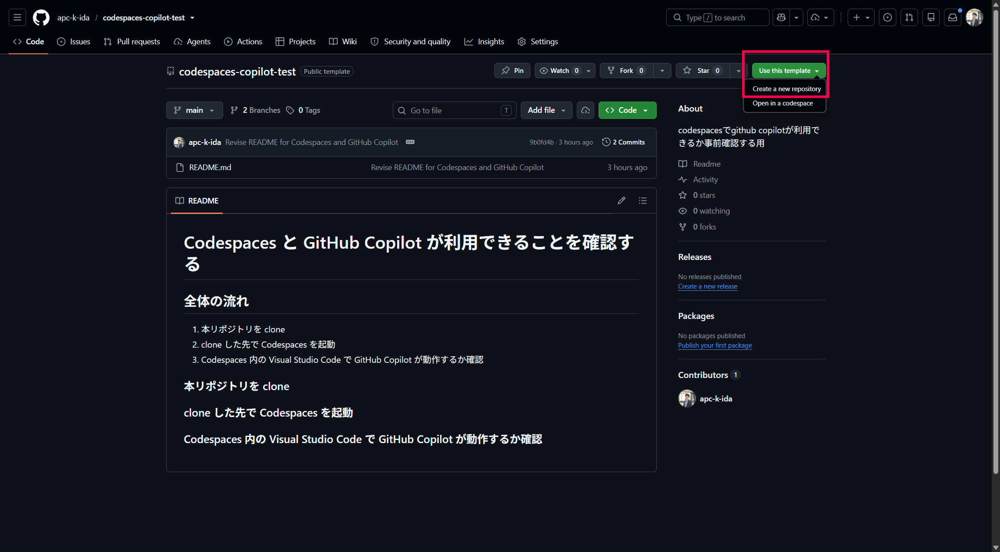
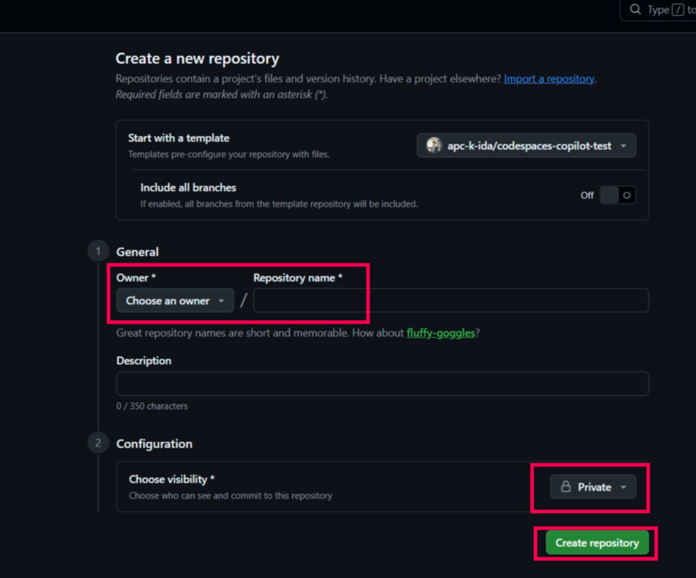
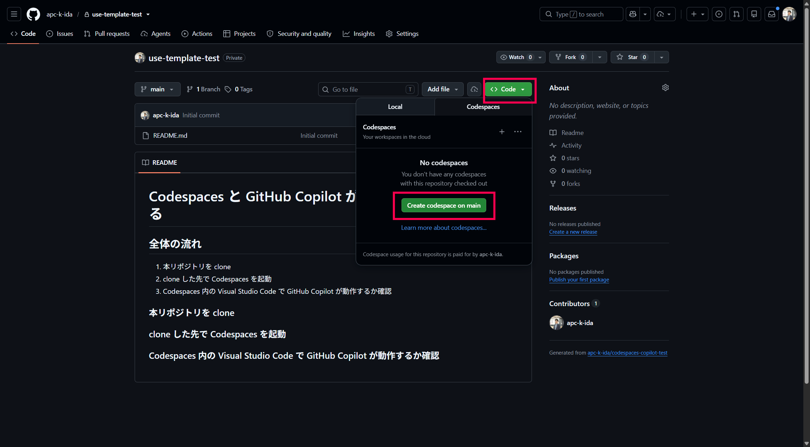
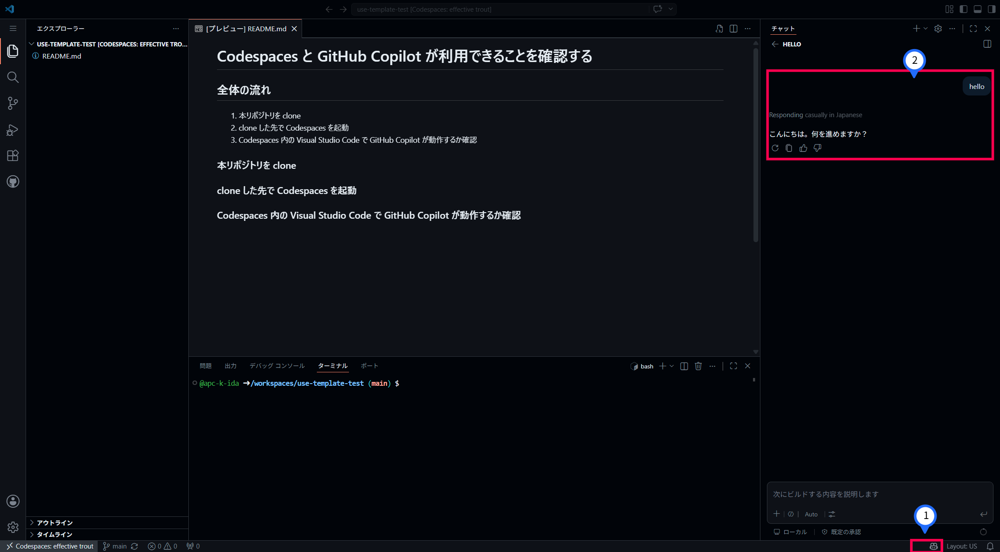
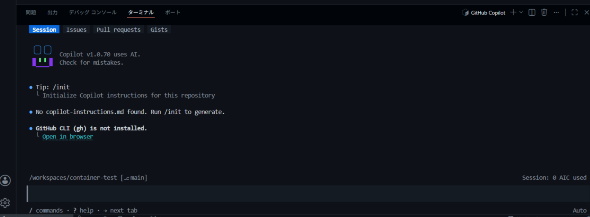
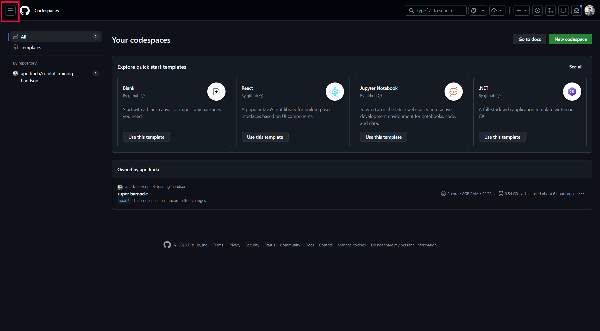
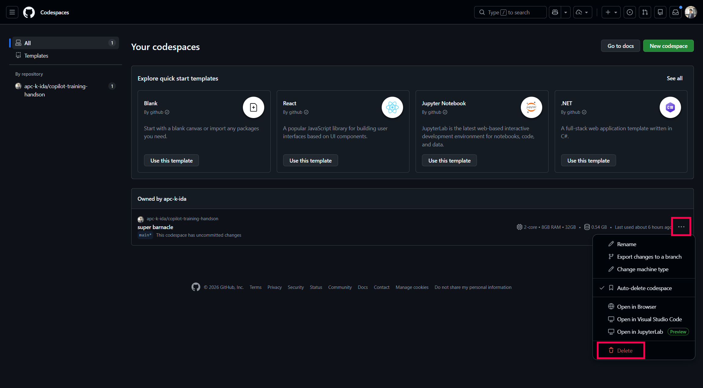

# Codespaces と GitHub Copilot が利用できることを確認する

## 全体の流れ

1. 本リポジトリを複製
2. 複製先で Codespaces を起動
3. Codespaces 内の Visual Studio Code で GitHub Copilot が動作するか確認
4. (Copilot CLIを利用する場合) CLI の動作確認
5. Codespaces の削除

### リポジトリの複製簡易版

[ここをクリックしてリポジトリを複製](https://github.com/new?template_owner=apc-k-ida&template_name=codespaces-copilot-test&owner=%40me&name=codespaces-copilot-test2&visibility=private)

### 1. 本リポジトリを複製

**「Use this template」** の **「Create a new repository」** を選択

Owner をご自身のアカウント、任意のリポジトリ名を入力し、リポジトリの可視性は Private を選択してください。 
最後に **「Create repository」** でリポジトリを複製します。

### 2. 複製先で Codespaces を起動

**「Code の Codespaces タブ」** の **「Create codespace on main」** を選択し、Codespaces を起動します。

### 3. Codespaces 内の Visual Studio Code で GitHub Copilot が動作するか確認

Codespaces を起動すると、その環境内で Visual Studio Code が立ち上がります（数分かかる可能性があります）。 
右下の Copilot アイコン部分でサインインをした後に、右側のチャットウィンドウに何かを入力し、Copilot から応答があれば動作確認は完了です。

### 4. (Copilot CLIを利用する場合)CLI の動作確認

このリポジトリでは GitHub Copilot CLI も使えるようにしています。

1. VS Code のターミナルで `copilot` と入力し Enter を押すと、Copilot CLI が起動します。
2. `/login` で GitHub にサインインする
3. `/model` で `Auto` を選択する
4. `hello` などを入力し、Copilot から応答があれば動作確認は完了です。

### 5. Codespaces の削除

Codespaces は時間単位の従量課金のため、不要となった場合は削除を推奨いたします。
詳細は[公式ドキュメント](https://docs.github.com/en/billing/concepts/product-billing/github-codespaces)をご確認ください。

左上のハンバーガーメニューから、**「Codespaces」** を選択。

削除したい Codespace の「…」から「Delete」で削除します。

